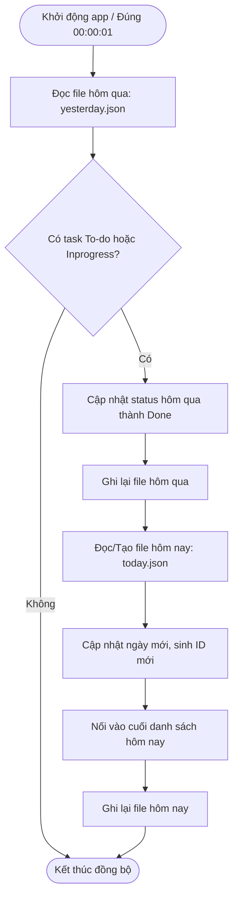

# 📝 Todo List CLI

Ứng dụng quản lý công việc cá nhân hàng ngày trên giao diện dòng lệnh (CLI - Command Line Interface), được xây dựng bằng ngôn ngữ **Go (Golang)**

Ứng dụng hỗ trợ lưu trữ dữ liệu theo từng ngày độc lập dưới định dạng JSON, tự động sắp xếp độ ưu tiên và tích hợp cơ chế **tự động chuyển tiếp công việc chưa hoàn thành sang ngày mới**

## 🌟 Tính năng nổi bật

- 📅 **Quản lý công việc theo ngày**: Xem danh sách task hôm nay hoặc xem lại lịch sử bất kỳ ngày nào (`DD/MM/YYYY`)
- ⚡ **Sắp xếp thông minh**: Tự động ưu tiên hiển thị theo mức độ ưu tiên (`High` > `Medium` > `Low`) và thời gian bắt đầu (`StartTime`)
- 🛠️ **Thao tác CRUD đầy đủ**:
  - `1. Task by today`: Xem danh sách task của ngày hiện tại
  - `2. Task by date`: Xem danh sách task theo ngày tùy chọn
  - `3. Add task`: Thêm task mới vào ngày hôm nay với đầy đủ thông tin (Tên, Trạng thái, Ưu tiên, Giờ bắt đầu, Giờ kết thúc)
  - `4. Edit task`: Chỉnh sửa thông tin task theo ngày và mã ID
  - `5. Update status for today task`: Cập nhật nhanh trạng thái task hôm nay
  - `6. Delete task`: Xóa task khỏi danh sách
- 🔄 **Tự động chuyển tiếp task (Auto-Carryover & Midnight Sync)**:
  - **Quét khi khởi động (Startup Hook)**: Khi mở ứng dụng trong ngày mới, hệ thống tự động quét các task có trạng thái `To-do` hoặc `Inprogress` của ngày hôm qua, gán lại ngày hôm nay và nối vào cuối danh sách ngày mới
  - **Bộ theo dõi nửa đêm (Midnight Watcher Goroutine)**: Chạy nền ngầm để tự động kích hoạt chuyển task đúng lúc `00:00:01` nếu ứng dụng được mở xuyên đêm
  - Tự động đánh dấu các task cũ ở ngày hôm trước thành `Done`
- 💾 **Lưu trữ JSON phân tán theo ngày**: Dữ liệu mỗi ngày được lưu thành 1 file riêng biệt `data/YYYY-MM-DD.json`

## 📁 Cấu trúc thư mục dự án

```text
todo_list_cli/
├── data/                  # Thư mục chứa dữ liệu JSON theo ngày (YYYY-MM-DD.json)
│   ├── 2026-09-27.json
│   └── 2026-09-28.json
├── go.mod                 # Go module definition
├── main.go                # Điều hướng Menu (Controller), các hàm CRUD và hàm main()
├── task.go                # Định nghĩa cấu trúc dữ liệu Task struct
├── utils.go               # Xử lý File I/O, chuyển đổi thời gian, Auto-Sync & Midnight Watcher
└── README.md              # Tài liệu hướng dẫn dự án
```

## 📊 Mô hình dữ liệu (Data Model)

Mỗi công việc (`Task`) được lưu trữ với cấu trúc:

```go
type Task struct {
    ID        string    `json:"id"`         // Mã định danh tự tăng (t1, t2, ...)
    Name      string    `json:"name"`       // Tên công việc
    Status    string    `json:"status"`     // Trạng thái: To-do | Inprogress | Done
    Priority  string    `json:"priority"`   // Độ ưu tiên: High | Medium | Low
    StartTime time.Time `json:"start_time"` // Thời gian bắt đầu (RFC3339)
    EndTime   time.Time `json:"end_time"`   // Thời gian kết thúc (RFC3339)
}
```

## 🚀 Hướng dẫn cài đặt & Sử dụng

### 1. Yêu cầu hệ thống

- Đã cài đặt **Go** (phiên bản 1.20 trở lên)

### 2. Chạy ứng dụng

Mở terminal tại thư mục dự án:

```bash
# Chạy trực tiếp
go run .

# Hoặc biên dịch thành file thực thi
go build -o todo_list_cli.exe
./todo_list_cli.exe
```

### 3. Giao diện điều khiển (Menu Console)

```text
-- TODO LIST CLI (1.0.0) ----------
1. Task by today
2. Task by date
3. Add task
4. Edit task
5. Update status for today task
6. Delete task
0. Exit
>. Input your option:
```

## 🔄 Cơ chế hoạt động của Auto-Carryover

